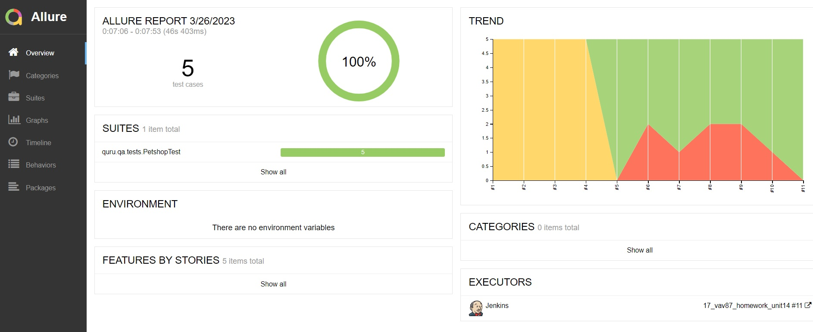
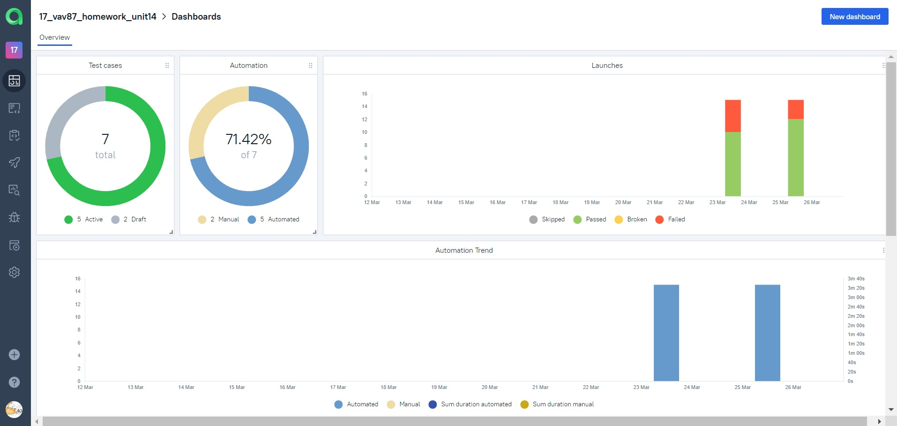
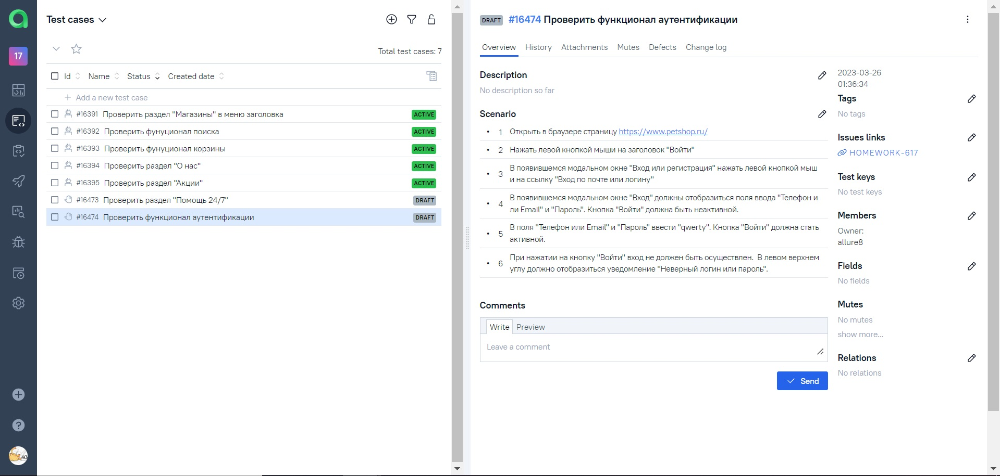
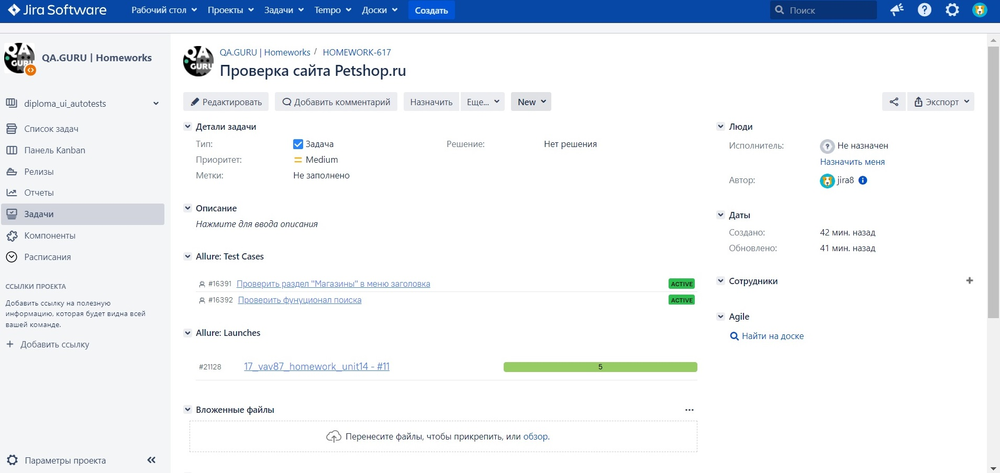
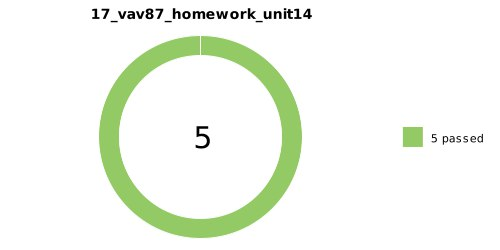

### 14
1. Выберите вакансию
2. Напишите на неё автотестов (5-10, простых, главное не тратьте на это много времени!)
3. Сделайте джобу в Jenkins, добавьте Allure отчёт, уведомления в чат Telegram, Selenoid.
   4*. Добавьте интеграцию с Allure Testops, добавьте пару ручных тестов  (акцентируйте на этом в github readme)
5. Добавьте интеграцию с Jira
6. Оформите всё со скриншотами в readme.md

В поле ответа на задание приложите:
- Ссылку на джобу в Jenkins, репозиторий с тестами на github, скриншот письма рекрутёру.
- Если вы не находитесь в поиске работы, просто сбросьте всё вышеуказанное на ревью.

# :bookmark_tabs: Содержание
- [Технологии](#технологии)
- [Реализованные тесты](#реализованные-тесты)
- [Запуск тестов из терминала](#запуск-тестов-из-терминала)
- [Прогон тестов в Jenkins](#прогон-тестов-в-Jenkins)
- [Allure-отчеты](#allure-отчеты)
- [Интеграция с Allure TestOps](#интеграция-с-Allure-TestOps)
- [Интеграция с Jira](#интеграция-с-Jira)
- [Уведомления в Telegram боте](#уведомления-в-Telegram-боте)
- [Видео прогона теста в Selenoid](#видео-прогона-теста-в-Selenoid)

## Технологии

## Реализованные тесты

- :white_check_mark: Проверить раздел "О нас"
- :white_check_mark: Проверить раздел "Акции"
- :white_check_mark: Проверить раздел "Магазины" в меню заголовка
- :white_check_mark: Проверить фунуционал поиска
- :white_check_mark: Проверить фунуционал корзины
- :white_check_mark: Проверить раздел "Помощь 24/7"
- :white_check_mark: Проверить функционал аутентификации

## Запуск тестов из терминала

    gradle clean ui_test -Denv=local

## Прогон тестов в Jenkins

[Сборка Jenkins](https://jenkins.autotests.cloud/job/17_vav87_homework_unit14/)

Команда для запуска сборки:

    clean test -Dbrowser="${BROWSER}" -DbrowserSize="${BROWSER_SIZE}" -DbrowserVersion="${BROWSER_VERSION}" -DremoteUrl="${REMOTE}" -Denv="remote"

## Allure-отчет

[Ссылка на отчет](https://jenkins.autotests.cloud/job/17_vav87_homework_unit14/11/allure/#)

## Интеграция с Allure TestOps

[Ссылка на dashboard](https://allure.autotests.cloud/project/2077/dashboards)

## Интеграция с Jira

[Ссылка на страницу проекта в Jira](https://jira.autotests.cloud/browse/HOMEWORK-617)

## Уведомления в Telegram боте

## Видео прогона теста в Selenoid

https://user-images.githubusercontent.com/32894442/227956410-b52c5ec0-c737-43af-a42c-220b9917f9fa.mp4

